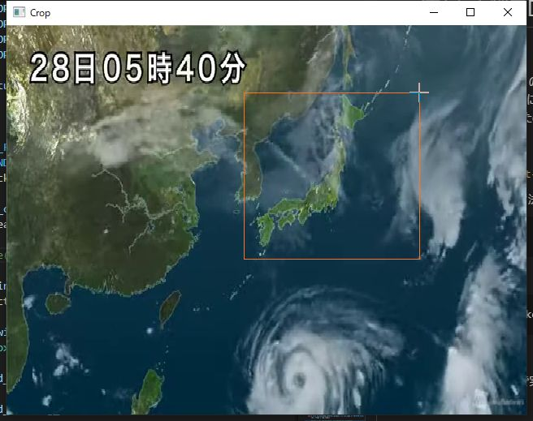
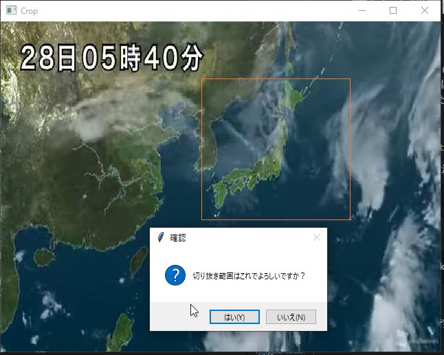

# 流量計測プログラムの使い方

## 開発目的
令和3年度（2021年）の卒論を参照してください．
分からないことがあったら，私は2024年3月までは旭川高専専攻科にいるはずなので先生に「（卒論作者名）の居場所は？」と聞いてください．
多分いつでも教えられます．
自動でCNT配向膜を作るための第一歩としてこれを作成しました．

## 使い方

`controller_gui/cnt-maker.pyw`を実行してください．

ラズパイ実機での実行方法はターミナル（端末）を開き，プログラムのあるディレクトリに移動した後，
```
./cnt-maker.pyw
```
か，
```
python ./cnt-maker.pyw
```
で実行できます．

以下はWindows環境で実行したときの様子ですがラズパイ上でもそれほど違いはないです．
### 1.入力ソースの選択


プログラムを実行するとこの画面が出るはずなので，使いたい入力元に合わせてボタンを押してください．

「いいえ」を押して動画ファイルを入力ソースとした場合，動画ファイルを選択するウィンドウが開くのでそこで選択してあげてください．

<div style="page-break-before:always"></div>

### 2.切り抜き範囲指定（カメラを入力ソースとした場合のみ）
ドラッグで切り抜き範囲を指定する．操作の参考画像として以下のものがあります．


<div style="page-break-before:always"></div>

ドラッグしたあと，確認ダイアログが出てくるのでよければ「はい」を選択します．



このとき水滴の出てくる部分を切り抜くようにする．参考画像として以下のものがあります．


<div style="page-break-before:always"></div>

### 3.背景画像の設定
次に水滴が出てきたことを検知するために必要な背景画像の設定を行う．
以下の画像のように，Croppedウィンドウ内に水滴が映っていないときを見計らってProcessing Statusウィンドウ内の`Set this image as a reference`ボタンを押してください．


その後，水滴が落ちてくると勝手に計測が始まります．

<div style="page-break-before:always"></div>

### 4.画面の説明
* Processing Statusウィンドウ


①現在の状態を表示する．

②滴下数を表示する．

③直前の滴下からの経過時間を表示する．

④最初の滴下からの経過時間を表示する．

⑤ペリスタポンプの速さを操作する．

「Reset Counter」ボタン：Drop Countを0にする．

「Set this Image as a reference」ボタン：基準とする背景画像をセットする．

* Binaryウィンドウ
「Threshold」スライドバー：2値化する際の閾値をセットする．


## 開発を始めるにあたって
Visual Studio Codeは必須ソフトです．ないと辛いのでインストールすることを**強く**お勧めします．インストールした後はPylance，Pythonといった拡張機能を入れるとよいでしょう．私は開発するためにWindowsPCを使いましたが，おそらくMacとかでも動くはずです．このときは`controller_gui/pump-factory.py`のos判別部分を書き換えてください．そのままだと多分落ちると思います．

## その他
私は作成したプログラムをUSBに入れてラズパイに持ち込んでいましたが，他にいい方法があったらどんどん改良していってください．あとはラズパイ4なんかもねだったら買っていただけるはずなので性能でフレームレートを殴ることもできると思います．そのときはCPUクーラーは必須なので気をつけてください．在庫が1つあるはずなのでそれを使うか，今のラズパイ3B+についているやつを外して使うかしてください．

吸光度の測定結果をグラフにしたり，配向度を出力することもpythonで全て自動化しようかと考えたけど数回しか計測しなかったのでやらんかった．


筐体の3Dモデルは下記のリンク先にあります．

* カメラマウント
[https://cad.onshape.com/documents/e055ae9ee38184f142d0783e/w/7d1514e5d21174cea9620fb4/e/d880f20e711d09f41dc087c4](https://cad.onshape.com/documents/e055ae9ee38184f142d0783e/w/7d1514e5d21174cea9620fb4/e/d880f20e711d09f41dc087c4)

* LEDストロボマウント
[https://cad.onshape.com/documents/48f89809b6e3f2968a377291/w/7b4dfebdee91749d272f5899/e/e9d66064590c8b0f19ddfb29](https://cad.onshape.com/documents/48f89809b6e3f2968a377291/w/7b4dfebdee91749d272f5899/e/e9d66064590c8b0f19ddfb29)

* 点滴筒支え
[https://cad.onshape.com/documents/48f89809b6e3f2968a377291/w/7b4dfebdee91749d272f5899/e/e9d66064590c8b0f19ddfb29](https://cad.onshape.com/documents/48f89809b6e3f2968a377291/w/7b4dfebdee91749d272f5899/e/e9d66064590c8b0f19ddfb29)

* 10x10アルミ角材（おまけ）
[https://cad.onshape.com/documents/d814670850ea6af3e357498c/w/8237ca72e091558f90af53e6/e/1cf3b2993e31caa2c83ee23f](https://cad.onshape.com/documents/d814670850ea6af3e357498c/w/8237ca72e091558f90af53e6/e/1cf3b2993e31caa2c83ee23f)


2022/02/18 システム制御情報工学科5年 武井 冬馬